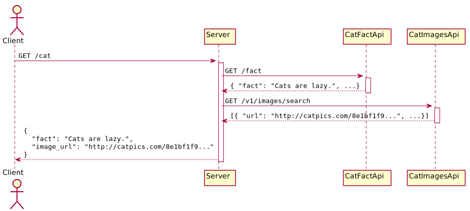
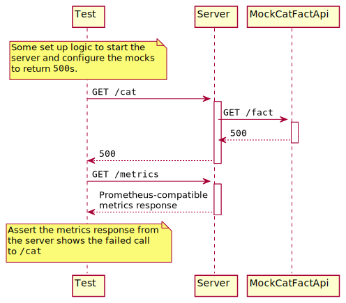
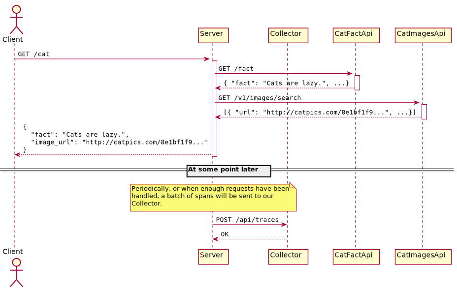

+++
title="When Is A \"Black Box\" Test Not A \"Black Box\" Test?"
date=2021-11-13

[extra]
toc = true
+++

In a microservice architecture, [component testing](https://martinfowler.com/articles/microservice-testing/#testing-component-introduction) is a crucial aspect of any comprehensive testing strategy. These tests encourage engineers to treat our services as "black boxes" that we can not see inside. We invoke the service's logic only through its public interface and verify its behaviour by observing its subsequent interactions with the world around it.

When we run these services in production, however, we require some degree of observability from them. We must be able to quickly detect when our services' SLIs drop below the SLOs we have set, and then have enough telemetry data to be able to quickly hone in on a root cause.

This might seem inconsistent; we treat our services as "black boxes" during component testing, but demand observability from them in production.

In reality, the observability of the service forms part of its contract with the world around it, in the same way as do its domain-specific APIs.

In this post, I'll show a couple of ways we can expand on component tests that exercise domain-specific behaviour of a service to also verify, and therefore prevent regressions in, our service's observability.

<!-- more -->

---

_All code in this post is written in [Rust](https://www.rust-lang.org/), and viewable in [GitHub](https://github.com/alexchilcott/blog-post-observable-component-tests). The approaches that are explored are applicable to any language._

_This post assumes a working knowledge of [Prometheus](https://prometheus.io/docs/introduction/overview/) and [Jaeger](https://www.jaegertracing.io/docs/1.28/)/[OpenTelemetry](https://opentelemetry.io/docs/concepts/what-is-opentelemetry/)._

---

## Our Cat Service

Let's define a service, which has an important job to do. It will:

- host a `GET /cat` route ([source](https://github.com/alexchilcott/blog-post-observable-component-tests/blob/cc544fe8374153fe5af8973536c8cd48de007e8d/cat_server/src/server/get_cat_route.rs#L34)), which:
  - retrieves a cat-related fact from [catfact.ninja](https://catfact.ninja/fact);
  - retrieves a URL of a picture of a cat from [thecatapi.com](https://api.thecatapi.com/v1/images/search); and
  - returns both to the caller in the form `{ "fact": "<some fact about cats>", "image_url": "<url of a cat photo>" }`.

<figure>
    
    <figcaption>Our Cat service and its interactions with third-party APIs</figcaption>
</figure>

Running our service manually, we can verify that it appears to work.

However, with no tests in place, we are relying on extensive manual testing each time we make a change to verify its behaviour. This is laborious and error-prone.

## Our First Component Test

To component test this service, we need to run the service as closely to how it runs in production as possible. Instead of mocking any logic internal to the service in our tests, we will:

- start mocks of any external API our service interacts with;
- configure those mocks with their initial state;
- interact with the service's public API, as a true user of the service would; and
- verify the outcome of that interaction.

Each test for this service will start three HTTP servers - one for the service itself, and one for each of our mocked third-party APIs. The service will be configured with URLs that point to the mocks in place of the URLs that would be used in production for the live APIs.

<figure>
    
    <figcaption>A basic component test, exercising our Cat service</figcaption>
</figure>

A basic component test ([source](https://github.com/alexchilcott/blog-post-observable-component-tests/blob/cc544fe8374153fe5af8973536c8cd48de007e8d/cat_server/tests/all/tests.rs#L19)) for this service starts with an `Arrange` phase, which:

- starts the mocks of the service's dependencies (encapsulated in a `TestHarness`, for ease of reuse); and
- configures the mock to return `200` responses while capturing the image URL and fact that the mocks will return.

```rust
let test_harness = TestHarness::start().await;
let cat_image_url = test_harness.mock_cat_images_api.configure_cat_image_url().await;
let cat_fact = test_harness.mock_cat_facts_api.configure_cat_fact().await;
```

During the `Act` phase, we make an HTTP request to the service's `/cat` endpoint:

```rust
let response_body = test_harness
    .client
    .get(test_harness.build_url("/cat"))
    .send()
    .await
    .expect("Failed to make request to server")
    .json::<CatFactAndImageUrl>()
    .await
    .expect("Failed to deserialize body");
```

And finally, during the `Assert` phase, we check that the response from the service contains the fact and image URL our mocks were configured to return.

```rust
assert_eq!(response_body.fact, cat_fact);
assert_eq!(response_body.image_url, cat_image_url);
```

So far, so good. We could write various permutations of this test, simulating different error conditions (third-party APIs returning `500`s or malformed responses, timeouts, etc.) and call it a day.

We are not done yet, though.

## Metrics

In our company where we run this service, we use Prometheus to monitor our services, and trigger alerts based on the metrics the service exposes.

Once Prometheus discovers a target (in this case, our service), it will, by default, periodically scrape metrics from the service's `GET /metrics` endpoint. The response has to contain metrics about the service in a [format Prometheus understands](https://github.com/prometheus/docs/blob/main/content/docs/instrumenting/exposition_formats.md).

We want to be able to trigger an alert when the proportion of `GET /cat` requests to our service that result in a `500` response breaches a certain threshold. What do we require on our service's public contract to implement this requirement?

- Our service should host a `GET /metrics` endpoint.
- The response from that endpoint should:
  - contain a set of samples in the Prometheus format; and
  - include a metric called `http_requests_total`, which counts the number of requests made to the service, and has `endpoint`, `method` and `status_code` labels

Now we have clarified these requirements, we write tests for them, to give us some confidence that they are met. Without doing so, we risk accidentally changing this behaviour in the future and finding ourselves in an uncomfortable conversation where a client is informing us of degradation to our service before we knew about it ourselves.

We define some component test scenarios to protect this behaviour as so:

> Given my service has received a `GET /cat` request which was handled successfully, when it then receives a `GET /metrics` request, it should respond with a Prometheus-compatible response that contains an `"http_requests_total"` metric, with `"endpoint"`=`"/cat"`, `"method"`=`"GET"`, and `"status_code"`=`"200"`, whose value is `1`.

and

> Given my service has received a `GET /cat` request which it was unable to handle, when it then receives a `GET /metrics` request, it should respond with a Prometheus-compatible response that contains an `"http_requests_total"` metric, with `"endpoint"`=`"/cat"`, `"method"`=`"GET"`, and `"status_code"`=`"500"`, whose value is `1`.

Let's take a look at the second test ([source](https://github.com/alexchilcott/blog-post-observable-component-tests/blob/cc544fe8374153fe5af8973536c8cd48de007e8d/cat_server/tests/all/tests.rs#L102)). Here's what it will do:

<figure>
    
    <figcaption>A component test that exercises the metrics reported by our Cat service</figcaption>
</figure>

First, the `Arrange` phase. We configure our mocks to return `500`s, and then we send a `GET /cat` request to our API, which correctly returns a `500`:

```rust
let test_harness = TestHarness::start().await;
test_harness.mock_cat_images_api.setup_failure().await;
test_harness.mock_cat_facts_api.setup_failure().await;

let status_code = test_harness
    .client
    .get(test_harness.build_url("/cat"))
    .send()
    .await
    .expect("Failed to make request to server")
    .status();
assert_eq!(status_code, StatusCode::INTERNAL_SERVER_ERROR);
```

In our `Act` phase, we make an HTTP request to our service's `/metrics` endpoint, just as Prometheus would:

```rust
let response = test_harness
    .client
    .get(test_harness.build_url("/metrics"))
    .send()
    .await
    .expect("Failed to make request to server")
    .error_for_status()
    .expect("Server returned an error status code");
```

And finally, during `Assert`, we parse the response from the `/metrics` endpoint, and check that it contains the sample we expect:

```rust
// Parse the body of the response from the /metrics endpoint
let metrics = parse_metrics_response(response)
    .await
    .expect("Failed to parse metrics");

// Then check the `http_requests_total` metric
let sample = metrics
    .samples
    .iter()
    .find(|sample| { // <-- this is Rust's closure syntax. This block is a
                     // predicate function that takes a sample and returns
                     // `true` if it has the name and labels we are looking
                     // for.
        sample.metric == "http_requests_total"
            && sample.labels.get("endpoint") == Some("/cat")
            && sample.labels.get("method") == Some("GET")
            && sample.labels.get("status") == Some("500")
    })
    .expect(r#"No matching http_requests_total sample found for "/cat" endpoint"#);

assert_eq!(sample.value, Value::Counter(1.into()));
```

Great! We have some confidence that our service will do _The Right Thing™_ when it comes to the metrics it exports. Assuming the other pieces of the alerting puzzle are working (a big assumption, the testing of which is outside the scope of this post), our brave oncallers will be awoken from their slumber when our service's error rate breaches the alerting threshold we set. Bleary-eyed, our oncaller heads to our tracing UI to begin to triage...

_Oh. The service's traces aren't correct..._

## Traces

Traces, like metrics, are often something that engineers get working in their service, check manually once the service is deployed to a test environment, and then call it a day. Unfortunately, also like metrics, if we inadvertently break this behaviour and do not have tests in place that catch this for us, we risk noticing only at the worst possible time; during an incident.

For our service, let's imagine a relatively simple configuration for exporting traces. Our service will send traces, in the Jaeger format, to a Jaeger-compatible collector, such as the OpenTelemetry collector. From there it will be exported to whichever backends we use to visualize our traces. Sampling of traces will be handled by the collector.

<figure>
    
    <figcaption>Exporting traces from our services to an OpenTelemetry collector</figcaption>
</figure>

Crystallising this design into some concrete requirements, we will say for every HTTP request our service handles, it should:

- Eventually send a trace to the collector, using the [Jaeger API](https://www.jaegertracing.io/docs/1.28/apis/#thrift-over-http-stable).
- The trace should be named `HTTP request`.
- The trace should contain `http.status_code`, `http.method`, and `http.route` tags.

With a bit of work to build a mock collector that can receive our spans and store them in memory for later querying, we can begin to verify this behaviour of our service rather nicely through our tests.

We will define a component test to verify our traces as so:

> Given my service has received a `GET /cat` request which was handled successfully, then eventually, the collector should receive a trace for this request. This trace should contain a span whose operation name is `HTTP request`, and should have a tags for `http.status_code`, `http.method` and `http.route` whose values are `200`, `GET`, and `/cat` respectively.

_"Eventually"? What's that about?_

We are testing asynchronous behaviour. In production, traces are typically batched by the service and sent asynchronously to the collector. This is by design, to prevent delays or failures in pushing traces resulting in the degradation of our service, and to reduce the chattiness of our service when sending traces over the network. However, this introduces uncertainty into our tests.

To overcome this, we might choose to run our service in a "test mode" to make this behaviour synchronous for our tests, but this increases the room for bugs that only manifest themselves in "non-test-mode" to slip into our service.

Depending on the language and ecosystem you are using to build your service, and the extent to which your test logic is able to trigger behaviour inside your service, there may be nice ways to minimise this delay. For example, the OpenTelemetry SDK specification describes a [ForceFlush](https://github.com/open-telemetry/opentelemetry-specification/blob/3e380e249f60c3a5f68746f5e84d10195ba41a79/specification/trace/sdk.md#forceflush) method. While triggering this from tests would cross the boundary between the service logic and the test logic, rather than strictly testing the service only through its public API, it is worth considering to keep your tests running quickly and reliably.

However, even if we do manually flush any pending spans, there may still be a small delay before we can query these from our mock collector. Flushing the spans is not necessarily synchronous.

So, we pick a timeout to allow for the traces our mock collector has received to eventually match the expectations in our tests. The longer the timeout, the longer it may take broken tests to fail, but the lower the risk of false negatives, where the service behaviour is correct but our timeout was _just too short_. It usually makes sense to optimise for non-flaky tests, and choose a generous timeout.

As in our first test, we set up our HTTP request to succeed inside the `Arrange` phase ([source](https://github.com/alexchilcott/blog-post-observable-component-tests/blob/cc544fe8374153fe5af8973536c8cd48de007e8d/cat_server/tests/all/tests.rs#L211)):

```rust
let test_harness = TestHarness::start().await;
test_harness.mock_cat_images_api.configure_cat_image_url().await;
test_harness.mock_cat_facts_api.configure_cat_fact().await;
```

During `Act`, we:

- open a span;
- make an HTTP request to `GET /cat`, propagating our current tracing context inside the request; and
- capture the trace ID from the span we created.

```rust
let trace_id = {
    let test_span =
        info_span!("cat_endpoint_sends_a_trace_that_shows_the_incoming_http_request");
    test_harness
        .client
        .get(test_harness.build_url("/cat"))
        .send()
        .instrument(test_span.clone())
        .await
        .expect("Failed to make request to server")
        .error_for_status()
        .expect("Expected a success response");

    test_span.otel_trace_id()
};
```

Finally, in our `Assert` phase, we:

- query our collector to retrieve the trace;
- check the trace has a span with the correct name; and
- check the span has the correct tags.

Since the behaviour is asynchronous, we retry until it either succeeds or a timeout elapses:

```rust
wait_10_seconds_for_trace(
    test_harness.jaeger_collector_server,
    trace_id.clone(),
    |trace| { // This block is a function that will run every time we want to make
              // assertions against the current state of the trace. The
              // wait_10_seconds_for_trace function polls our mock collector's
              // in-memory collection of traces and terminates once a trace exists
              // that passes all the expectations below.
        let span_node = trace
            .descendants()
            .find(|s| s.borrow().operation_name == "HTTP request")
            .ok_or_else(|| anyhow!(r#"No span found named "HTTP request""#))?;

        check_tag(&span_node, "http.method", TagValue::String("GET"))
            .context("span method was not correct")?;
        check_tag(&span_node, "http.route", TagValue::String("/cat"))
            .context("span route was not correct")?;
        check_tag(&span_node, "http.status_code", TagValue::Long(200))
            .context("span status code was not correct")
    },
)
.await
.expect("Expected trace was not available within timeout");
```

If you are worried this looks like a painfully slow test to run, worry not!

```
running 1 test
test tests::cat_endpoint_sends_a_trace_that_shows_the_incoming_http_request ... ok

test result: ok. 1 passed; 0 failed; 0 ignored; 0 measured; 4 filtered out; finished in 0.01s
```

Success! From this starting point, we can build up much richer tests that check many details about any traces we publish, and therefore, the information that will be available during incidents for debugging. For example:

- Do our spans have the correct domain-specific tags that we want to enrich them with, such as `user_id`?
- Do we add correlation IDs for our third-party API calls to their spans?
- Do we capture useful details of errors on spans for calls that failed?

Tests such as these will give us much more confidence that our traces will look as we expect them to, when we need to rely on them.

## Wrapping Up

So, where do we stand now?

There is still much that could go awry. Misconfigured network policies may block traffic between our service and our observability tooling. Our PromQL expressions for our alerts or dashboard panels might not be correct. Our PagerDuty configuration might not be as we expected it to be.

However, by considering our service's observability requirements in terms of its specific interactions with the world around it, we have been able to exercise that behaviour through component testing. We have bought ourselves some confidence in our service's observability today, and some protection against regressions tomorrow.
